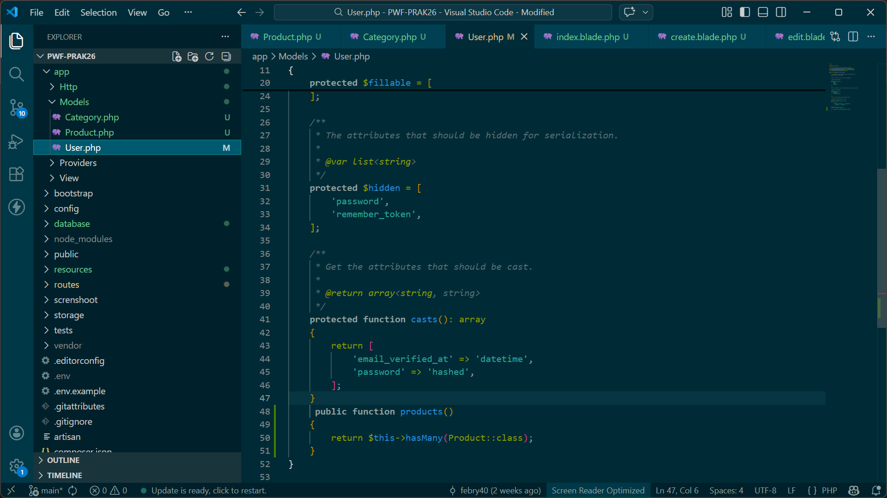
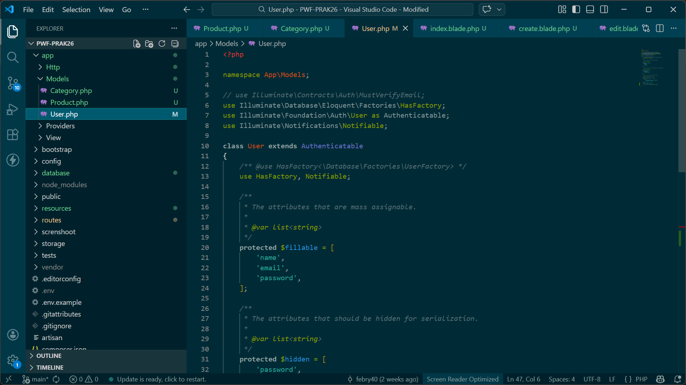
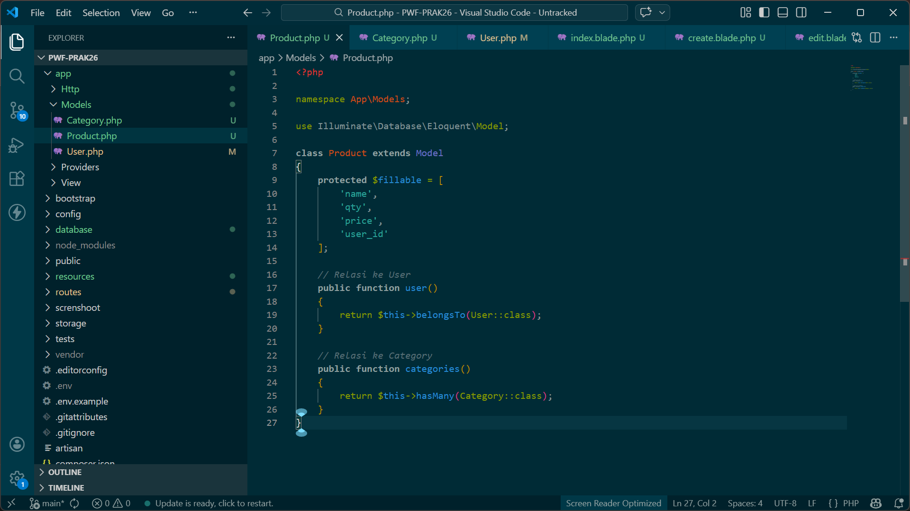
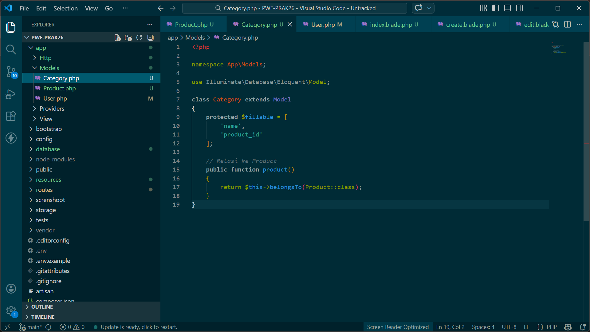
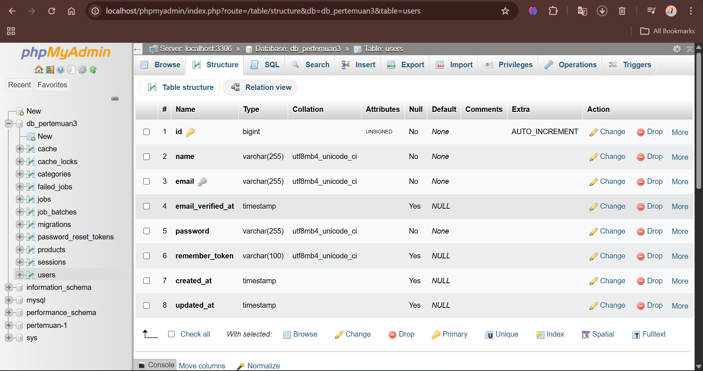
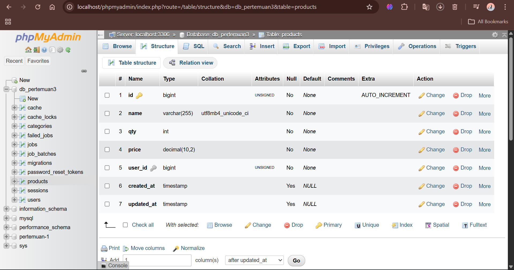
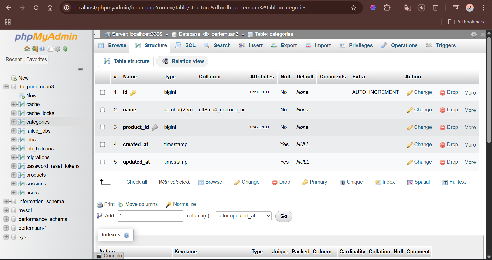

# Pertemuan 3
## Pembuatan Model dan Migration Laravel
## 1. Model

### Model User

Model User digunakan untuk merepresentasikan tabel users pada database.

### Model Product

Model Product digunakan untuk mengelola data produk yang tersimpan pada database.

### Model Category

Model Category digunakan untuk mengelola data kategori produk.

---

## 2. Migration

### Migration Products

Migration ini digunakan untuk membuat tabel products pada database.

### Migration Categories

Migration ini digunakan untuk membuat tabel categories pada database.

---

## 3. Struktur Database

Database dilihat menggunakan phpMyAdmin.

### Tabel Users

### Tabel Products

### Tabel Categories

